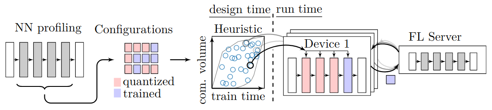
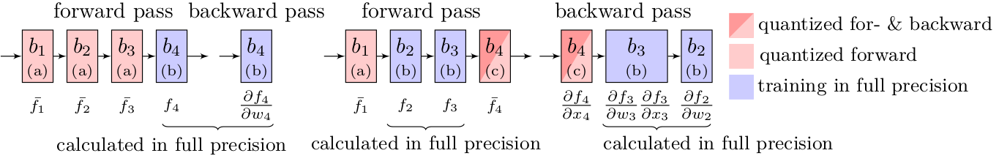

# CoCoFL: Communication- and Computation-Aware Federated Learning via Partial NN Freezing and Quantization

> Kilian Pfeiffer, Martin Rapp, Ramin Khalili, Jörg Henkel  
> CoCoFL: Communication- and Computation-Aware Federated Learning via Partial NN Freezing and Quantization  
> in Transactions on Machine Learning Research (TMLR) 06/2023  
> https://openreview.net/pdf?id=XJIg4kQbkv

## Installation & Dataset Preparation
* Install requirements with `python3 -m pip install -r requirements.txt`
* Datasets CIFAR-10, CIFAR-10, CINIC-10 require no manual downloads
* For IMDB, parts are already stored in the repository, others are automatically downloaded
* Files for SHAKESPEARE are already in the repository's data folder
* For the FEMNIST experiments, it is required to download the inputs and targets from [here](https://drive.google.com/file/d/1ZFPbHddOBIkaNZcyezUuKxSSqwaHDdrE/view?usp=sharing) or [here](https://bwsyncandshare.kit.edu/s/r3R8feQRkBkCx5x/download/femnist_data.zip) and put them into the `data/femnist` folder
* Data for XCHEST is automatically loaded from [here](https://bwsyncandshare.kit.edu/s/fEwKeDoHKDtnzF7/download/xchest2.tar.gz)

## Run FL Experiments
Each run (with specific arguments) creates an folder (`run_HASH`) with a specific hash of the configuration. If a specific run is run again, the results are overridden. The experiment folder is created at `runs/{session_tag}/`. Every 25 FL rounds, plots are generated. Alternativly, plots can be generated manually using `python3 utils/plots.py --session_tag {SESSION_TAG}`

Main experiments from Table 2 in the paper can be run by using
* `python3 main.py --algorithm CoCoFL --network MobileNet --dataset CIFAR10 --data_distribution NONIID --seed 10 --noniid_dirichlet 0.1 --n_rounds 1000 --lr 0.1 --lr_schedule 600 800 --torch_device cuda`

FedAvg and Centralized Baselines can be run by using
* `--algorithm FedAvg` (full resources)  
* `--algorithm FedAvgDropDevices` Devices that do not have full resources are dropped from training  
* `--algorithm Centralized`   

## Profiling
For profiling with ARM a pip wheel is required that is compiled with the `qnnpack` quantization backend. For x64, the `fbgemm` backend is used.
`python3 profiling.py --network MobileNet --architecture X64`
This creates `json` files in the`profiling` folder. The tables used for the experiments are already put in `nets/QuanizedNets/{NN-structure}/tables/`